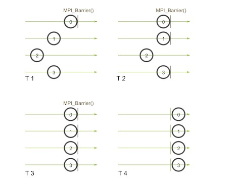
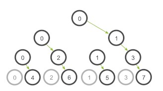
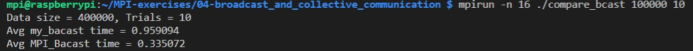

[MPI Tutorial: mpi-broadcast-and-collective-communication](https://mpitutorial.com/tutorials/mpi-broadcast-and-collective-communication)
```cpp
// Blocks until all processes in the communicator have reached this routine.
int MPI_Barrier(MPI_Comm communicator);

// Broadcasts a message from the process with rank "root" to all other processes of the communicator
MPI_Bcast(void* data, int count, MPI_Datatype datatype, int root, MPI_Comm communicator);

// Returns an elapsed time on the calling processor
double MPI_Wtime(void);
```

`MPI_Barrier()`用来进程间同步，调用后所有的进行都会同步到这个Barrier之后再执行之后的语句。




`MPI_Bcast()`用于广播，从根节点广播消息到其他进程，MPI提供树形消息传递。





可以看到MPI提供的广播函数和自己实现的广播函数的区别：

