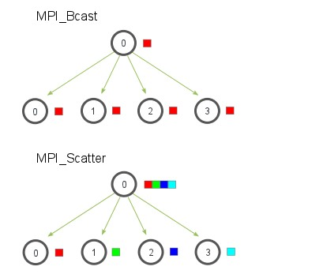
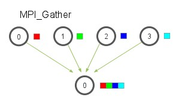
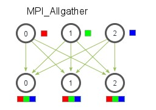
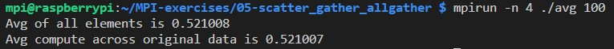
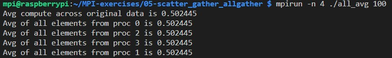

[MPI Tutorial: MPI Scatter, Gather, and Allgather](https://mpitutorial.com/tutorials/mpi-scatter-gather-and-allgather)

```cpp
// Sends data from one process to all other processes in a communicator
int MPI_Scatter(const void *sendbuf, int sendcount, MPI_Datatype sendtype,
               void *recvbuf, int recvcount, MPI_Datatype recvtype, int root,
               MPI_Comm comm)

// Gathers together values from a group of processes
int MPI_Gather(const void *sendbuf, int sendcount, MPI_Datatype sendtype,
               void *recvbuf, int recvcount, MPI_Datatype recvtype,
               int root, MPI_Comm comm)

// Gathers data from all tasks and distribute the combined data to all tasks
int MPI_Allgather(const void *sendbuf, int sendcount, MPI_Datatype sendtype,
                  void *recvbuf, int recvcount, MPI_Datatype recvtype,
                  MPI_Comm comm)
```

## MPI_Scater

`MPI_Scater`和`MPI_Bcast()`类似，都是从根节点向其他节点发送消息，不同的是Scater发送部分数据到其他节点。




## MPI_Gather

`MPI_Gather()`和`MPI_Scatter()`刚好相反，它是从多个进程收集数据到一个进程，根据rank收集数据。



`MPI_Gather()`中只有根进程需要有效的缓冲区，其他传递NULL给recvbuf即可；另外recvcount是指从每个进程接受的数据量，而不是数据总量之和。


## MPI_Allgather

`MPI_Allgather()`相当于`MPI_Gather()`+ `MPI_Bcast()`

每个进程按照rank来收集数据。




## 运行




