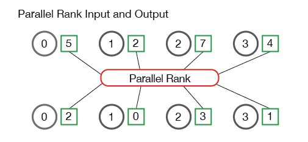
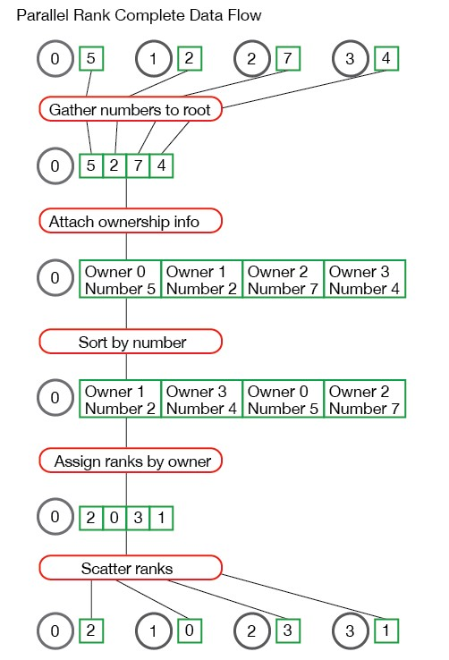
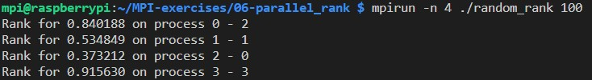

[MPI Tutorial: Performing Parallel Rank with MPI](https://mpitutorial.com/tutorials/performing-parallel-rank-with-mpi)

```cpp
// Return the number of bytes occupied by entries in the datatype
int MPI_Type_size(MPI_Datatype datatype, int *size);
```

## 并行排名

每个进程在本地内存存储了一个数，所有进程中存储的数字构成了一个数字集合，了解该数组相对于整个数字集合的排名是有用的。可以用于MPI群集中的处理器进行基准测试，得到每个处理器相对于其他处理器有多快。从而可以用于安排调度任务。





