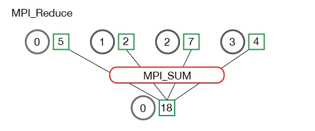
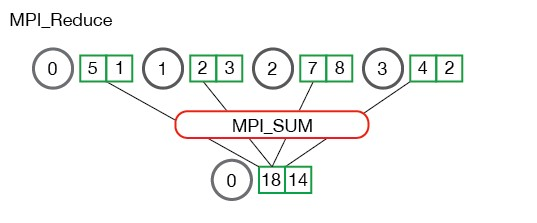
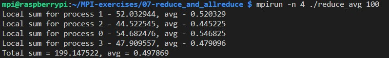
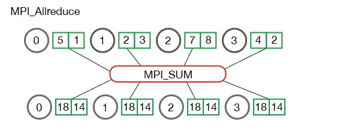
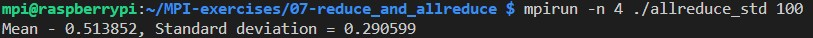

[MPI Turotial: MPI Reduce and Allreduce](https://mpitutorial.com/tutorials/mpi-reduce-and-allreduce)


## MPI_Reduce

```cpp
// Reduces values on all processes to a single value
int MPI_Reduce(const void *sendbuf, void *recvbuf, int count, MPI_Datatype datatype,
               MPI_Op op, int root, MPI_Comm comm)
```

MPI_MAX - 返回最大元素。

MPI_MIN - 返回最小元素。

MPI_SUM - 对元素求和。

MPI_PROD - 将所有元素相乘。

MPI_LAND - 对元素执行逻辑与运算。

MPI_LOR - 对元素执行逻辑或运算。

MPI_BAND - 对元素的各个位按位与执行。

MPI_BOR - 对元素的位执行按位或运算。

MPI_MAXLOC - 返回最大值和所在的进程的秩。

MPI_MINLOC - 返回最小值和所在的进程的秩。







MPI_Reduce基于每个元素进行。 不是将所有数组中的所有元素累加到一个元素中，而是将每个数组中的第 i 个元素累加到进程 root 结果数组中的第 i 个元素中。





## MPI_Allreduce

```cpp
// Combines values from all processes and distributes the result back to all processes
int MPI_Allreduce(const void *sendbuf, void *recvbuf, int count,
                  MPI_Datatype datatype, MPI_Op op, MPI_Comm comm)
```




