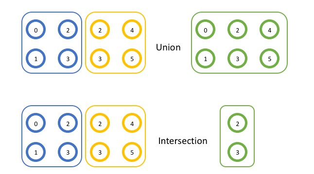
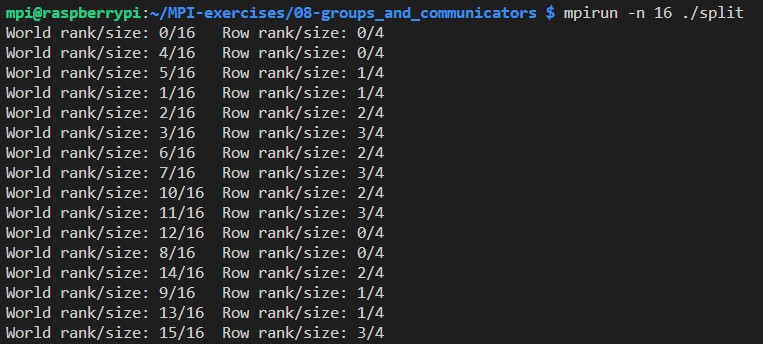
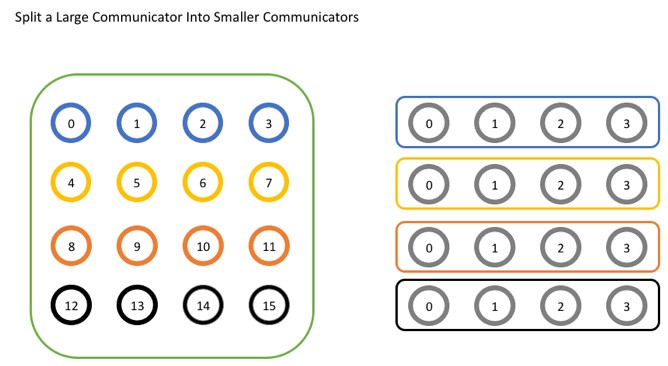
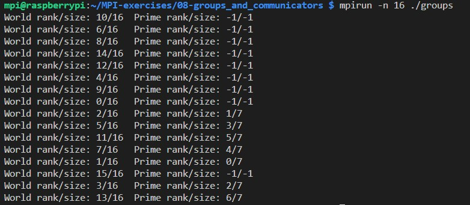

[MPI Tutorial: Introduction to Groups and Communicators](https://mpitutorial.com/tutorials/introduction-to-groups-and-communicators/)


```cpp
// Creates new communicators based on colors and keys
int MPI_Comm_split(MPI_Comm comm, int color, int key, MPI_Comm *newcomm);

// Creates a new communicator
int MPI_Comm_create(MPI_Comm comm, MPI_Group group, MPI_Comm *newcomm);

// Creates a new communicator
int MPI_Comm_create_group(MPI_Comm comm, MPI_Group group, int tag, MPI_Comm * newcomm);

// Accesses the group associated with given communicator
int MPI_Comm_group(MPI_Comm comm, MPI_Group *group);

// Produces a group by combining two groups
int MPI_Group_union(MPI_Group group1, MPI_Group group2, MPI_Group *newgroup);

// Produces a group as the intersection of two existing groups
int MPI_Group_intersection(MPI_Group group1, MPI_Group group2, MPI_Group *newgroup);

// Produces a group by reordering an existing group and taking only listed members
int MPI_Group_incl(MPI_Group group, int n, const int ranks[], MPI_Group *newgroup);

```







